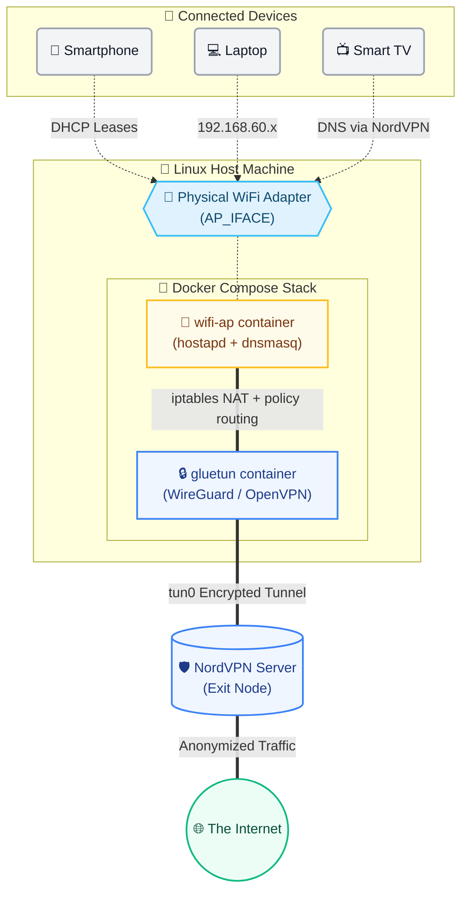

# NordVPN Containerized WiFi Access Point

Transform your Linux machine into a robust, dedicated VPN WiFi router. This project uses a containerized architecture to broadcast a secure WiFi hotspot that automatically routes 100% of its connected clients' traffic through an encrypted NordVPN tunnel.

## 🌟 Features
- **Dual Protocols:** Choose between **OpenVPN** or **WireGuard** (NordLynx) depending on your speed and stability needs.
- **Containerized Architecture:** Uses [Gluetun](https://github.com/qdm12/gluetun) for the VPN connection and a custom Debian `wifi-ap` container (running `hostapd` and `dnsmasq`) for the hotspot.
- **Zero DNS Leaks:** Configured to push NordVPN's official DNS servers directly to hotspot clients, circumventing geo-blocks and streaming restrictions.
- **Strict Kill-Switch:** Network traffic is physically bound to the VPN container's namespace. If the VPN drops, hotspot internet drops. No leaks, ever.
- **Interactive Setup Wizard:** Arrow-key menu (Up/Down + Enter) for WiFi interface and VPN type selection.
- **Safer Secret Input:** Passwords/keys are masked with `*` while typing.
- **Smart Runtime Handling:** Detects running `gluetun`/`wifi-ap` containers and prompts to stop or exit.
- **Auto Cleanup on VPN Type Change:** If you switch `VPN_TYPE`, old containers/images are cleaned before rebuild.

---

## 🏗 Architecture & Traffic Flow

The system isolates all WiFi clients from your host's local network and forces their internet traffic through the NordVPN tunnel.



### 🛣️ How It Works (Traffic Flow)
1. **Client Connection:** Devices connect to the WiFi network broadcasted by the `wifi-ap` container utilizing `hostapd`.
2. **DHCP & DNS:** The `wifi-ap` container uses `dnsmasq` to assign `192.168.60.x` IP addresses and pushes NordVPN's DNS servers (`103.86.96.100`, `103.86.99.100`) to completely prevent DNS leaks.
3. **Policy Routing:** The `wifi-ap` container applies `iptables` rules and `ip rule` to intercept all traffic originating from the `192.168.60.x` subnet and transparently NATs it to the `gluetun` container.
4. **Encryption:** The `gluetun` container encapsulates the traffic using WireGuard or OpenVPN, sending it out securely via its `tun0` interface.
5. **Strict Kill-Switch:** If the VPN connection drops, `gluetun`'s internal firewall immediately blocks any outgoing traffic. This severs the internet connection for all WiFi clients instantly, ensuring 0% chance of an unencrypted IP leak.

---

## ⚙️ Setup & Installation

### 1. Prerequisites
- 🐧 **Linux Machine** (tested on Ubuntu/Garuda).
- 🐳 **Docker & Docker Compose** installed.
- 📡 **Physical WiFi adapter** capable of Access Point (AP) mode.

### 2. First-time Interactive Setup
Run the included startup wizard to automatically configure your environment:

```bash
chmod +x startup.sh
./startup.sh
```

The script will interactively prompt you for:
- 📡 **WiFi Interface (`AP_IFACE`)**: Select your adapter from a populated list.
- 🛡️ **VPN Protocol (`VPN_TYPE`)**: Choose `wireguard` or `openvpn` using an arrow-key menu.
- 🔑 **NordVPN Credentials**: Required keys/passwords (masked while typing for security).
- 📶 **Hotspot Configuration**: Your desired SSID and password.

> [!NOTE]
> All values are saved to a `.env` file in the repository root. Subsequent runs will use this configuration automatically. If containers are already running, the wizard will prompt you to gracefully stop them. It also intelligently cleans up old images/containers if you switch VPN protocols.

> [!TIP]
> **OpenVPN Credentials:** Use NordVPN **Service Credentials** (not your standard account password). You can find these at:
> `https://my.nordaccount.com/dashboard/nordvpn/manual-configuration/service-credentials/`

> [!IMPORTANT]
> **WireGuard Key Extraction:** NordVPN does not display NordLynx private keys directly.
> 1. Generate an **Access Token** from the NordVPN Dashboard (under Manual Setup).
> 2. Run the following command in your terminal:
> ```bash
> curl -s -u token:<YOUR_TOKEN> https://api.nordvpn.com/v1/users/services/credentials | jq -r .nordlynx_private_key
> ```

### 3. Manual Configuration (Optional)
If you prefer not to use the interactive wizard, you can manually configure the `.env` file:
```bash
cp .env.example .env
```
Open `.env` in your favorite editor and populate the required variables.

---

## 🚀 Usage

**Start the Access Point:**
```bash
docker compose up -d --build
```

**Reconfigure Settings:**
```bash
./startup.sh
```

**Stop the Access Point:**
```bash
docker compose down
```

### 📊 Monitoring Logs

Monitor the VPN tunnel connection and health:
```bash
docker logs gluetun -f
```

Monitor connected devices, DHCP leases, and AP status:
```bash
docker logs wifi-ap -f
```

---

## 🛠 Troubleshooting

> [!WARNING]
> **Clients connect but report "No Internet"**
> 1. Check if Gluetun successfully established a connection: `docker logs gluetun`
> 2. Ensure your `FIREWALL_OUTBOUND_SUBNETS` variable in `.env` accurately reflects your host machine's LAN IP range.
> 3. Restart the AP container to force it to re-inject the namespace routing rules: `docker compose restart wifi-ap`

> [!CAUTION]
> **Streaming Apps (like JioHotstar, Netflix) detect the VPN**
> Streaming services aggressively block known VPN IP addresses.
> 1. **Rotate IP:** Force the VPN to grab a new server IP by restarting the tunnel: `docker compose restart gluetun`
> 2. **Mobile Users:** Go to your phone's App Settings and explicitly **Deny** "Location" permissions for the streaming app, then clear the app's cache. Streaming apps often compare your VPN IP against your phone's physical GPS location.

---
<div align="center">
  <i>Built with ❤️ utilizing <a href="https://github.com/qdm12/gluetun">Gluetun</a> and Hostapd.</i>
</div>
