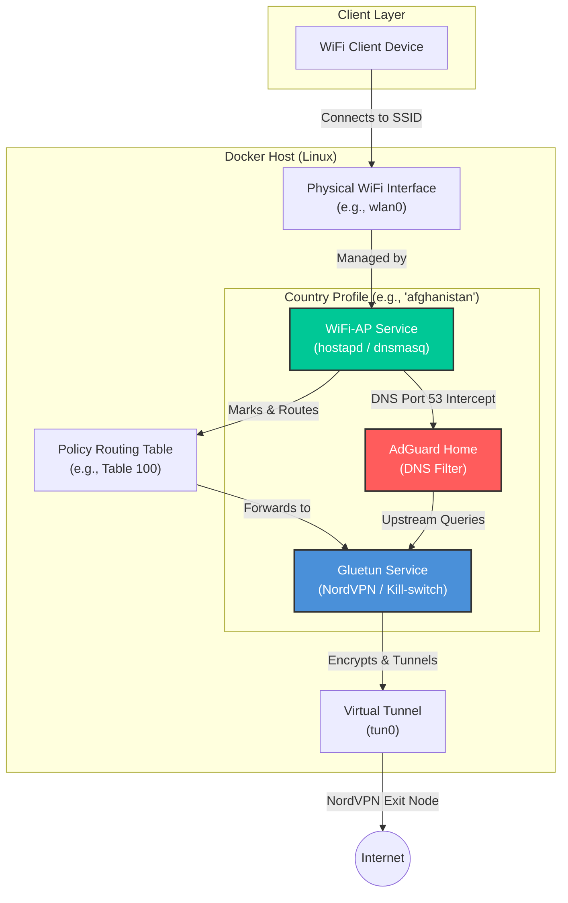
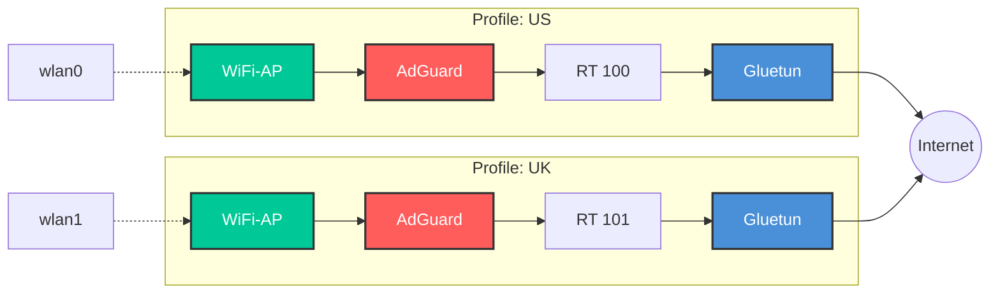

# NordVPN Dockerized Access Point (NordVPN-AP)

A powerful, multi-profile Dockerized solution to turn your Linux machine into a NordVPN-protected WiFi Access Point. This project features a sleek, networked **Rust API Orchestrator & Web Dashboard** for managing and monitoring your access point stacks remotely, supporting both **NordLynx (WireGuard)** and **OpenVPN** protocols.

---

## 🚀 Features

- **Rust API Orchestrator**: A lightweight Axum backend that programmatically manages access point sibling stacks on the host via Docker.
- **Web Dashboard UI**: A premium, responsive dark-mode dashboard (HTML/CSS/JS with glassmorphism aesthetics) served directly by the orchestrator.
- **VPN Location Driven Flow**: The Create AP form modal places VPN Location at the very top. Selecting a country dynamically auto-populates the Profile ID slug (e.g. `germany`, `united_states`) and the SSID (e.g. `AP_Germany`, `AP_United_States`) in real-time, preserving user overrides.
- **WiFi Security Selection**: Supports multiple encryption modes: **None (Open Network)**, **WPA Legacy**, **WPA2 (Recommended)**, **WPA3 (Modern SAE)**, and **WPA2/WPA3 Mixed**.
- **Adapter-Aware WPA3 support**: Automatically probes host WiFi adapters to verify WPA3 capabilities (`SAE` key suite support). If the selected adapter lacks WPA3 support, WPA3 options are automatically disabled in the UI.
- **Interactive Password Toggling**: Selecting "None (Open Network)" dynamically hides the password input field and bypasses WPA validation checks.
- **Strict Password Validation**: Validates passwords to match standard WPA requirements (8 to 63 characters, printable ASCII only).
- **Multi-Profile Support**: Run multiple hotspots simultaneously on different WiFi interfaces (e.g., one for US, one for UK).
- **Built-in Kill-Switch**: Powered by [Gluetun](https://github.com/qdm12/gluetun), ensuring no data leaks if the VPN connection drops.
- **DNS Ad-Blocking**: Integrated per-stack AdGuard Home intercepts DNS queries to block ads while tunneling requests securely through the VPN.
- **WiFi Hardware Audit**: The *System → WiFi Hardware* page lists each detected interface with its supported bands, 802.11 standards (a/b/g/n/ac/ax), and WPA3 capability; the Create AP dialog only enables 802.11 modes your selected adapter actually supports.
- **Conflict Prevention**: Automatically allocates non-overlapping subnets (starting at `192.168.60.0/24`) and routing tables (starting at `100`) to prevent collisions between profiles.
- **API**: REST management API (see Endpoints). *Served without authentication — run on a trusted network or behind an authenticating reverse proxy.*

---

## 🏗 Architecture

### Single Profile Flow
Each profile consists of three primary services: **Gluetun** (VPN), **WiFi-AP** (Hotspot), and **AdGuard** (DNS Ad-Blocking). Traffic is routed through dedicated policy routing tables on the host to ensure all connected clients are protected, while DNS requests are silently intercepted and filtered.



### Multi-Country Scalability
The architecture supports running multiple stacks concurrently by isolating each profile with its own physical interface, subnet, and routing table. Each stack runs a fully isolated AdGuard Home instance.



---

## 🚦 Getting Started (Rust Web Orchestrator)

The Rust Orchestrator is the recommended way to deploy and manage your Access Points. It runs as a Docker container with host privilege capability and controls the other stacks via the Docker socket.

### 1. Setup VPN Credentials
Create a `.env.credentials` file in the project root directory containing your NordVPN service credentials:
```env
OPENVPN_USER="your-nordvpn-service-username"
OPENVPN_PASSWORD="your-nordvpn-service-password"
WIREGUARD_PRIVATE_KEY="your-wireguard-private-key"
```

**Getting your WireGuard private key:** NordVPN does not expose WireGuard keys from their dashboard directly. Generate an Access Token via the NordVPN Dashboard → Manual Setup, then run the following command to extract your key:

```bash
curl -s -u token:<YOUR_TOKEN> \
  https://api.nordvpn.com/v1/users/services/credentials \
  | jq -r .nordlynx_private_key
```

### 2. Launch the Orchestrator
Export the project directory on your host and run `docker compose` to start the orchestrator:
```bash
export HOST_PROJECT_DIR=$(pwd)
docker compose up -d --build
```

### 3. Open the Dashboard
Navigate your browser to `http://localhost:8080/`.
- The dashboard automatically detects and lists your WiFi interfaces and audits their capabilities.
- You can create, edit, start, stop, restart, delete, and view logs of all access point profiles directly from the Web UI.
- Stack status (running/starting/stopped, VPN IP) updates live over the WebSocket — no manual refresh.

---

## 🔌 API Endpoints Reference

The `ap-manager` exposes a REST API for remote management:

| Method | Endpoint | Description |
| :--- | :--- | :--- |
| `GET` | `/api/stacks` | List all AP profiles, active status, and VPN IPs |
| `POST` | `/api/stacks` | Create a new AP stack (auto-allocates subnet/routing table) |
| `GET` | `/api/stacks/:id` | Get detailed status of a specific AP stack |
| `PATCH` | `/api/stacks/:id` | Update an existing stack configuration |
| `DELETE` | `/api/stacks/:id` | Remove a stack and tear down its containers |
| `POST` | `/api/stacks/:id/start` | Start containers for a specific stack |
| `POST` | `/api/stacks/:id/stop` | Stop containers for a specific stack |
| `POST` | `/api/stacks/:id/restart` | Restart containers for a specific stack |
| `GET` | `/api/stacks/:id/logs` | Query container logs for Gluetun, WiFi-AP, and AdGuard |
| `GET` | `/api/credentials` | Query configured credentials configuration presence |
| `PATCH` | `/api/credentials` | Update OpenVPN or WireGuard credentials |
| `GET` | `/api/wifi/interfaces` | List host WiFi interfaces and audited capabilities |
| `GET` | `/api/vpn/locations` | Query available NordVPN exit node locations |
| `GET` | `/api/health` | Get health check status of the orchestrator and Docker daemon |
| `WS`  | `/ws/stacks` | Live stream of all stack statuses (JSON array); pushes on every start/stop/restart/create/update/delete |

*Note: The API is currently served without authentication. Deploy behind a trusted network or an authenticating reverse proxy before exposing it.*

---

## 📂 Project Structure

-   `src/`: The Rust orchestrator backend source code.
-   `static/`: The frontend web dashboard assets (HTML, CSS, JS).
-   `access_point/`: Docker build context for the physical WiFi Access Point container (`hostapd`/`dnsmasq`).
-   `country/`: Contains per-profile runtime state generated by the orchestrator (e.g., `country/us_ap/`).
-   `legacy/`: Contains legacy scripts and templates (`startup.sh`, `docker-compose.template.yaml`, etc.).

---

## 🛠 Prerequisites

-   **OS**: Linux (with a kernel that supports hostapd/policy routing).
-   **Docker & Docker Compose**: Installed and running.
-   **Hardware**: A WiFi network card that supports **AP (Access Point) mode**. Run `iw list` and look for `AP` in "Supported interface modes".
-   **Host Project Path Environment Variable**: When starting the orchestrator container, the absolute path to the project root on the host machine must be passed in the `HOST_PROJECT_DIR` environment variable (e.g., `export HOST_PROJECT_DIR=$(pwd)`). This enables sibling containers launched by the orchestrator (like AdGuard Home or hostapd) to correctly resolve bind mounts relative to the host filesystem.

---

## 🔧 Legacy CLI Wizard Usage

If you prefer terminal-only operation, you can still run the legacy setup script located inside the `legacy/` directory:
```bash
./legacy/startup.sh
```
Follow the interactive prompts to create, edit, or launch country profiles from your terminal shell. Refer to `startup.sh` usage by running `./legacy/startup.sh --help`.

---

## 📚 References

- **Understanding WiFi Standards (802.11a/b/g/n/ac/ax)**: [Standardy Wi-Fi](https://www.netia.pl/pl/blog/standardy-wi-fi-802-11-a-b-g-n-ac-ax)
- **hostapd documentation**: [w1.fi/hostapd](https://w1.fi/hostapd/)
- **Gluetun VPN client**: [GitHub - qdm12/gluetun](https://github.com/qdm12/gluetun)
