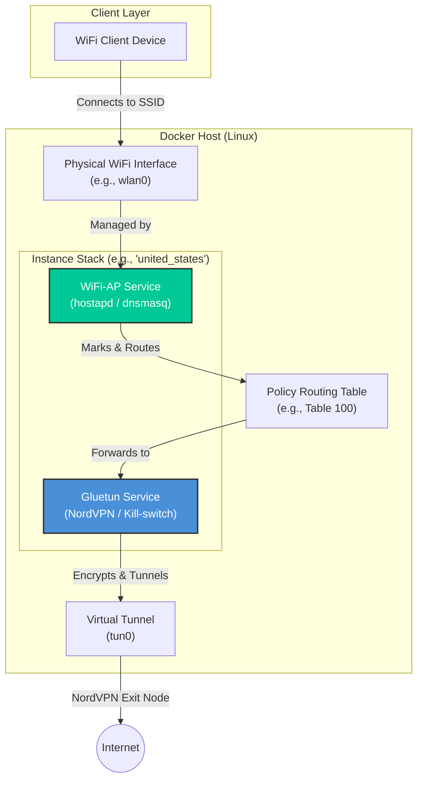
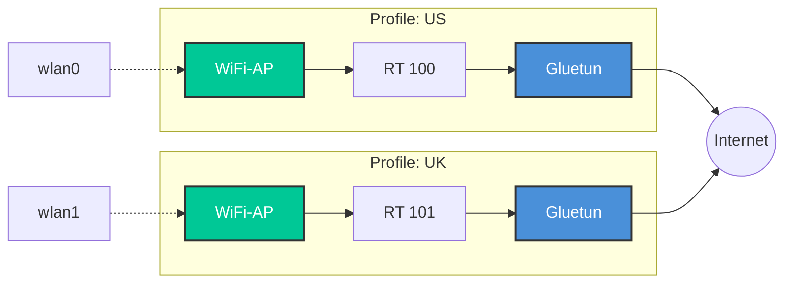

# NordVPN Dockerized Access Point (NordVPN-AP)

A powerful, multi-instance Dockerized solution to turn your Linux machine into a NordVPN-protected WiFi Access Point. It features a sleek interactive wizard for setup and management, supporting both **NordLynx (WireGuard)** and **OpenVPN** protocols.

## 🚀 Features

-   **Interactive Wizard**: User-friendly CLI (`startup.sh`) to create, edit, and manage VPN profiles.
-   **Multi-Instance Support**: Run multiple hotspots simultaneously on different WiFi interfaces (e.g., one for US, one for UK).
-   **NordLynx & OpenVPN**: Native support for high-performance NordLynx (WireGuard) or traditional OpenVPN.
-   **Built-in Kill-Switch**: Powered by [Gluetun](https://github.com/qdm12/gluetun), ensuring no data leaks if the VPN connection drops.
-   **WiFi Security**: Supports WPA2-PSK, WPA3-SAE, and Mixed mode.
-   **Health Monitoring**: Integrated health checks for VPN connectivity, public IP verification, and routing rules.
-   **Conflict Detection**: Automatically prevents IP, Subnet, and Interface conflicts between multiple instances.

---

## 🏗 Architecture

### Single Instance Flow
Each instance consists of two primary services: **Gluetun** (VPN) and **WiFi-AP** (Hotspot). Traffic is routed through dedicated policy routing tables on the host to ensure all connected clients are protected.



### Multi-Environment Scalability
The architecture supports running multiple stacks concurrently by isolating each instance with its own physical interface, subnet, and routing table.



---

## 🛠 Prerequisites

-   **OS**: Linux (tested on Ubuntu/Debian/Raspberry Pi OS).
-   **Docker & Docker Compose**: Installed and running.
-   **Hardware**: A WiFi network card that supports **AP (Access Point) mode**.
-   **Tools**: `curl`, `jq`, and optionally `fzf` (for an enhanced country selection experience).

---

## 🚦 Quick Start

### 1. Clone the repository
```bash
git clone https://github.com/your-username/nordvpn_ap.git
cd nordvpn_ap
```

### 2. Launch the Setup Wizard
```bash
./startup.sh
```
Follow the interactive prompts to:
1. Select your VPN protocol (WireGuard is recommended).
2. Provide your NordVPN credentials (private key for NordLynx or service credentials for OpenVPN).
3. Select your WiFi interface and set up your SSID/Password.
4. Choose your preferred VPN location.

---

## 📜 Management Scripts

### `startup.sh` (Interactive)
The primary entry point. Use this to:
-   Create new VPN profiles.
-   Edit existing configurations.
-   Start/Stop/Delete instances via a menu.
-   Update global VPN credentials.

### `manage.sh` (CLI)
A robust management tool for scriptable actions.

| Command | Description |
| :--- | :--- |
| `./manage.sh list` | List all instances and their current status. |
| `./manage.sh start <name>` | Build and start a specific instance. |
| `./manage.sh stop <name>` | Stop an instance (keeps containers). |
| `./manage.sh health` | Check VPN connectivity and routing for all instances. |
| `./manage.sh logs <name>` | Follow logs for a specific instance. |
| `./manage.sh delete <name>` | Completely remove an instance and its config. |

---

## 📂 Project Structure

-   `startup.sh`: Interactive setup and management wizard.
-   `manage.sh`: CLI backend for instance management.
-   `country/`: Contains per-instance configurations (e.g., `country/united_states/.env`).
-   `access_point/`: Docker build context for the WiFi Access Point service.
-   `docker-compose.template.yaml`: Template used to generate instance stacks.
-   `.env.credentials`: Secure storage for your NordVPN keys/passwords.

---

## 🔧 Configuration

Each instance has its own `.env` file located in `country/<instance_name>/.env`. Key variables include:

-   `VPN_TYPE`: `wireguard` or `openvpn`.
-   `SERVER_COUNTRIES`: Default country for the VPN connection.
-   `AP_IFACE`: The WiFi interface to use.
-   `AP_SSID` / `AP_PASSWORD`: WiFi credentials.
-   `ROUTING_TABLE`: Unique ID for the policy routing table (auto-assigned).
-   `FIREWALL_OUTBOUND_SUBNETS`: CIDR ranges that can bypass the VPN (e.g., your local LAN).

---

## 🚑 Troubleshooting

-   **WiFi Interface Errors**: Ensure your card supports AP mode. Run `iw list` and look for `AP` in "Supported interface modes".
-   **VPN Connection Issues**: Run `./manage.sh health` to check if `tun0` is up and if the public IP is correctly masked.
-   **Logs**: Use `./manage.sh logs <instance_name>` to see detailed output from both the VPN (Gluetun) and the AP service.

---

## 🔒 Security Note

This project stores credentials in `.env.credentials` and per-instance `.env` files with `600` permissions. Ensure your host system is secure and do not commit your `.env` files to public repositories.