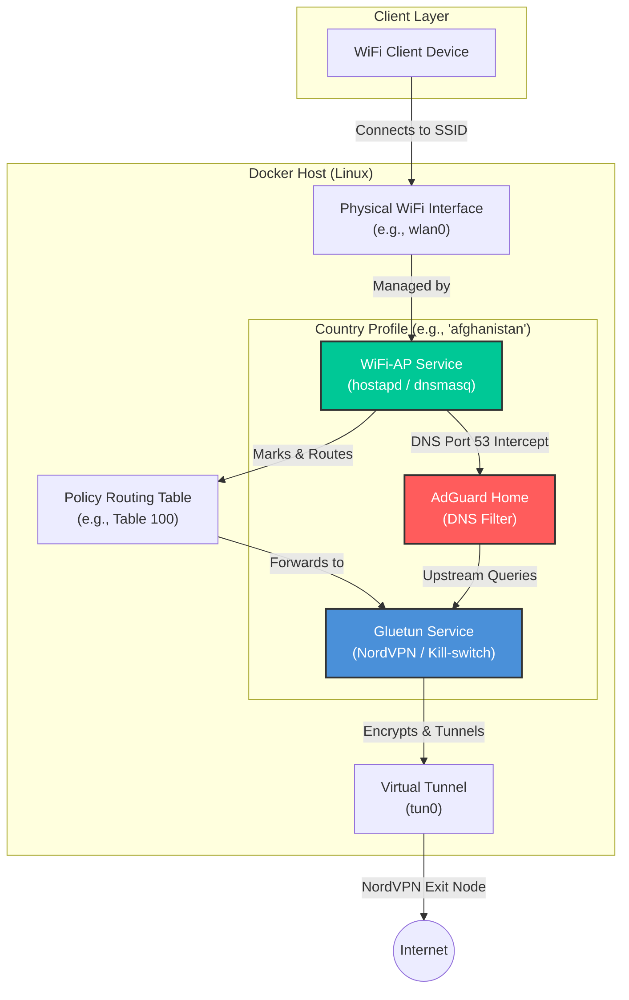
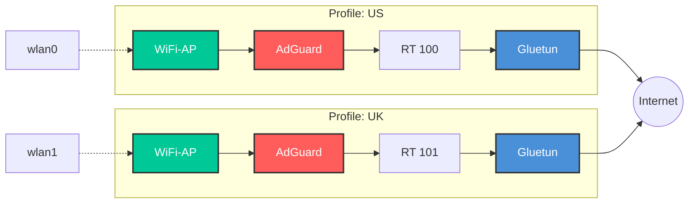

# nordvpn_ap

**Rust orchestrator + web dashboard that turns a Linux box into one or more NordVPN-tunneled WiFi access points.**

Route any device that can't run a VPN client, smart TVs, consoles, projectors, through an encrypted NordVPN tunnel just by connecting to a hotspot. No dedicated VPN router hardware needed.

## Why

Smart TVs and similar devices don't support VPN apps, and hardware VPN routers are pricey or underpowered. A VPN router is really just "VPN client + routing, in firmware." This project does that in Docker: any device joining the AP gets full-tunnel VPN coverage automatically, with per-stack isolation so you can run multiple APs (e.g. different exit countries) side by side.

## Stack topology

Each AP "stack" is a set of containers wired together per profile:

```
client device → hostapd/dnsmasq AP → gluetun (NordVPN/WireGuard) → internet
                                    ↳ AdGuard Home (ad-block DNS, in-namespace)
```

- **Orchestrator** (Rust / Axum / Tokio / bollard), manages Docker stacks, exposes REST + WebSocket API, serves the dashboard.
- **gluetun**, VPN tunnel + kill-switch per stack.
- **AdGuard Home**, per-stack DNS ad-blocking, runs inside gluetun's network namespace.
- **hostapd/dnsmasq** (`access_point/`), the actual WiFi AP container.

## 🏗 Architecture

### Single Profile Flow

Each profile consists of three primary services: **Gluetun** (VPN), **WiFi-AP** (Hotspot), and **AdGuard** (DNS Ad-Blocking). Traffic is routed through dedicated policy routing tables on the host to ensure all connected clients are protected, while DNS requests are silently intercepted and filtered.



### Multi-Country Scalability

The architecture supports running multiple stacks concurrently by isolating each profile with its own physical interface, subnet, and routing table. Each stack runs a fully isolated AdGuard Home instance.



---

## Features

- WireGuard key auto-fetch from a NordVPN access token (no manual key extraction)
- Full stack editing, SSID, password, security, channel, channel width, hardware mode, 12h auto-reconnect, with VPN location/profile ID kept immutable post-creation
- 12-hour scheduled VPN reconnect per stack for tunnel freshness
- Real-time telemetry bar (active/total stacks, tunneled gateways, wireless interfaces)
- Zero-config host path detection via container self-inspection, no env vars to export
- WiFi interface auditing (802.11a/b/g/n/ac/ax capability detection)
- WPA2 / WPA3(SAE) / Mixed / WPA-Legacy / Open security modes
- Integrated kill-switch (gluetun) + ad-blocking (AdGuard Home) per stack
- Live activity feed for system events

## Setup

### 1. Prerequisites check

```bash
ip a                     # confirm your WiFi adapter name (e.g. wlan0) and that it supports AP mode
iw list | grep -A 8 "Supported interface modes"   # verify "AP" is listed
```

Make sure Docker + Docker Compose v2 are installed and the daemon is running.

### 2. Clone the repo

```bash
git clone https://github.com/virajt71/nordvpn_ap.git
cd nordvpn_ap
```

### 3. Build and start the orchestrator

```bash
docker compose up -d --build
```

- Runs with `network_mode: host` + `privileged: true` (required for hostapd/interface/routing control).
- Mounts `/var/run/docker.sock` so the orchestrator can manage its own child containers (gluetun, AdGuard, WiFi-AP) via `bollard`.
- `HOST_PROJECT_DIR` is auto-detected on startup via `docker inspect` self-lookup, no manual env export needed. Override it in `docker-compose.yml` if auto-detection fails on your setup.
- `API_PORT` defaults to `42918`; change it in `docker-compose.yml` under `environment:` if needed.

### 4. Open the dashboard

```
http://localhost:42918/
```

### 5. Add your NordVPN credentials

Go to **Settings → NordVPN Credentials**:
- **WireGuard (NordLynx)**: paste your NordVPN access token → **Fetch Key** (auto-extracts and saves the private key)
- **OpenVPN**: enter your OpenVPN service username/password from the NordVPN dashboard

> Access token: NordVPN dashboard → Advanced settings → Access Token.

### 6. Create your first AP stack

From the dashboard: pick a WiFi interface, exit country/location, SSID, password, and security mode → create. The orchestrator auto-allocates a subnet and policy routing table, spins up gluetun + AdGuard Home + the hostapd/dnsmasq AP container, and streams live status over `/ws/stacks`.

To add another stack (e.g. a second country), repeat with a different physical WiFi interface, since each profile needs its own adapter.

### Persistent data

- `data/stacks.json`, `data/credentials.json`, and per-profile state under `country/` are created automatically on first run and persisted on the host via the bind mount in `docker-compose.yml`. Back these up if you want to preserve stack configs across host rebuilds.

## API

| Method | Endpoint | Description |
|---|---|---|
| GET | `/api/stacks` | List AP profiles, status, VPN IPs |
| POST | `/api/stacks` | Create stack (auto-allocates subnet/routing table) |
| GET | `/api/stacks/:id` | Stack detail |
| PATCH | `/api/stacks/:id` | Update stack config |
| DELETE | `/api/stacks/:id` | Remove stack + tear down containers |
| POST | `/api/stacks/:id/start` \| `/stop` \| `/restart` | Lifecycle control |
| GET | `/api/stacks/:id/logs` | Gluetun / WiFi-AP / AdGuard logs |
| GET / PATCH | `/api/credentials` | Query / update NordVPN credentials |
| GET | `/api/wifi/interfaces` | Host WiFi interfaces + capabilities |
| GET | `/api/vpn/locations` | Available NordVPN exit locations |
| GET | `/api/health` | Orchestrator + Docker daemon health |
| WS | `/ws/stacks` | Real-time stack status stream |

## Project layout

```
src/            Rust orchestrator (Axum, Tokio, bollard DockerManager)
static/         Web dashboard (HTML/CSS/JS, glassmorphic UI)
access_point/   Docker build context for the hostapd/dnsmasq AP container
country/        Per-profile runtime state (generated, e.g. country/us_ap/)
data/           Persistent JSON stores (stacks.json, credentials.json)
```

## Prerequisites

- Linux host with a kernel supporting `hostapd` and policy routing
- Docker + Docker Compose, with access to `/var/run/docker.sock`
- WiFi adapter that supports AP mode
- Runs `--privileged` + `network_mode: host` (needed for hostapd/interface control)

## References

- [WiFi standards overview (802.11a/b/g/n/ac/ax)](https://www.netia.pl/pl/blog/standardy-wi-fi-802-11-a-b-g-n-ac-ax)
- [hostapd docs](https://w1.fi/hostapd/)
- [gluetun](https://github.com/qdm12/gluetun)

## Credits

Foundational tunnel-sharing logic inspired by [dannypv05261/docker-vpn-ap](https://github.com/dannypv05261/docker-vpn-ap).

---

## Suggested GitHub repo description

> Rust/Axum orchestrator + dashboard for Docker-based NordVPN WiFi access points, multi-stack, kill-switch, ad-block DNS, per-device full-tunnel VPN with no client software.