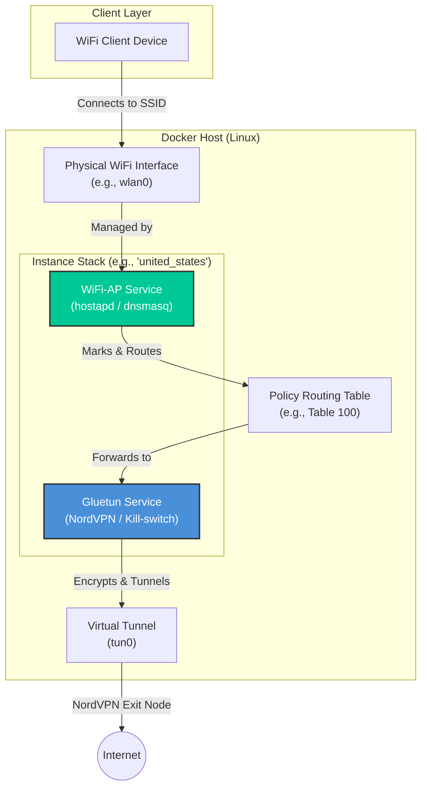

# NordVPN Containerized WiFi Access Point

> Turn any Linux machine into a privacy-first VPN router — no expensive hardware required.

This project broadcasts a WiFi hotspot that routes **100% of connected client traffic** through an encrypted NordVPN tunnel. Smart TVs, projectors, gaming consoles, or any device that can't run a VPN app natively gets full VPN coverage simply by connecting to the hotspot.

---

## 🎯 Why This Project Exists

The frustration of trying to watch region-locked content like Netflix India on a Smart TV or projector sparked this project. These devices don't support VPN clients natively, and dedicated VPN routers are either expensive or underpowered for the task.

The insight is straightforward: a VPN router is essentially just a device with a VPN client in its firmware and enough compute to handle routing. This project takes that idea and runs with it, using Docker and NordVPN to turn any standard Linux machine into a fully functional VPN Access Point. Once a device is connected to the hotspot, it is automatically routed through an encrypted tunnel—bypassing geo-restrictions and keeping all traffic private without requiring a VPN app on the end device.

## ✨ Features

- **Dual Protocol Support** — Choose **OpenVPN** for compatibility or **WireGuard (NordLynx)** for speed.
- **Containerized Stack** — [Gluetun](https://github.com/qdm12/gluetun) manages the VPN tunnel; a custom Debian `wifi-ap` container runs `hostapd` + `dnsmasq` for the hotspot.
- **Zero DNS Leaks** — NordVPN's DNS servers are pushed directly to clients, preventing geo-detection via DNS.
- **Strict Kill-Switch** — Traffic is bound to the VPN container's network namespace. VPN drops = hotspot internet drops. No exceptions.
- **Hot-Reloadable Config** — Change your SSID or passphrase without rebuilding containers.

---

## 🏗 Architecture

Each instance pairs two services: **Gluetun** (VPN + kill-switch) and **WiFi-AP** (hotspot). Policy routing tables on the host ensure all hotspot traffic is namespaced through the VPN — not the host's default route.



---

## ⚙️ Setup

### Prerequisites

| Requirement | Details |
|---|---|
| **OS** | Linux (tested on Ubuntu / Garuda) |
| **Runtime** | Docker + Docker Compose |
| **Network Hardware** | Two network paths: one for upstream internet, one for the AP |
| **WiFi Adapter** | Must support AP (Access Point) mode |

**Two-path network options:**
- ✅ **Ethernet + WiFi** *(Recommended)* — Ethernet for internet, WiFi adapter for the AP.
- **Dual WiFi** — Internal WiFi for internet, external USB adapter for the AP.

---

### 1. Configure Environment Variables

Create a `.env` file in the repository root:

```env
# OpenVPN credentials
OPENVPN_USER=your_nordvpn_service_user
OPENVPN_PASSWORD=your_nordvpn_service_password

# WireGuard credentials
WIREGUARD_PRIVATE_KEY=your_wireguard_private_key

# VPN target region
SERVER_COUNTRIES=India

# Bypass kill-switch for host LAN management access
FIREWALL_OUTBOUND_SUBNETS=192.168.50.145/32
```

> **Getting your WireGuard private key**
> NordVPN does not expose WireGuard keys from their dashboard directly.
> 1. Generate an Access Token via the NordVPN Dashboard → *Manual Setup*.
> 2. Run the following command to extract your key:
>    ```bash
>    curl -s -u token:<YOUR_TOKEN> \
>      https://api.nordvpn.com/v1/users/services/credentials \
>      | jq -r .nordlynx_private_key
>    ```

---

### 2. Customize Hotspot Settings *(Optional)*

Edit `access_point/hostapd.conf` inside your chosen protocol folder (`openvpn_config/` or `wireguard_config/`):

| Setting | Default |
|---|---|
| SSID | `MyHotspot` |
| Password | `ChangeMe123!` |

---

### 3. Configure for Your Hardware

> [!IMPORTANT]
> If you're running this on a machine other than the one this was developed on, you **must** update the WiFi interface name in three places.

Find your interface name first:
```bash
ip link
# or
iw dev
```

Then replace `wlxac15a2e2f47e` with your actual interface name (e.g., `wlan0`) in:

| File | Field to update |
|---|---|
| `access_point/wifi-ap-entrypoint.sh` | `AP_IFACE` |
| `access_point/hostapd.conf` | `interface` |
| `access_point/dnsmasq.conf` | `interface` |

Also update `FIREWALL_OUTBOUND_SUBNETS` in `.env` to match your host's LAN subnet (e.g., `192.168.1.0/24`) to retain SSH/management access.

---

## 🚀 Usage

Navigate to the config folder for your preferred protocol and bring up the stack:

```bash
# WireGuard (recommended for speed)
cd wireguard_config
sudo docker compose up -d

# OpenVPN
cd openvpn_config
sudo docker compose up -d
```

### Monitoring

```bash
# VPN tunnel status
sudo docker logs gluetun -f

# Hotspot status, connected clients, DHCP leases
sudo docker logs wifi-ap -f
```

---

## 🛠 Troubleshooting

**Clients connect but show "No Internet"**
1. Verify Gluetun connected successfully: `docker logs gluetun`
2. Confirm `FIREWALL_OUTBOUND_SUBNETS` matches your host's LAN IP.
3. Restart the AP container to re-inject namespace routing rules:
   ```bash
   sudo docker compose restart wifi-ap
   ```

**Streaming services (e.g., JioHotstar) are detecting the VPN**

Streaming platforms actively blocklist known VPN exit IPs.

1. Rotate to a new server: `sudo docker compose restart gluetun`
2. **Mobile devices:** Go to *App Settings* → **Deny** Location permission for the streaming app, then clear its cache. These apps cross-reference your VPN IP against GPS data.

---

## 🙏 Credits

Inspired by [dannypv05261](https://github.com/dannypv05261/docker-vpn-ap) for demonstrating the foundational logic of sharing a tunneled network over a WiFi Access Point.

---

*Built with ❤️ using [Gluetun](https://github.com/qdm12/gluetun) and [hostapd](https://w1.fi/hostapd/).*