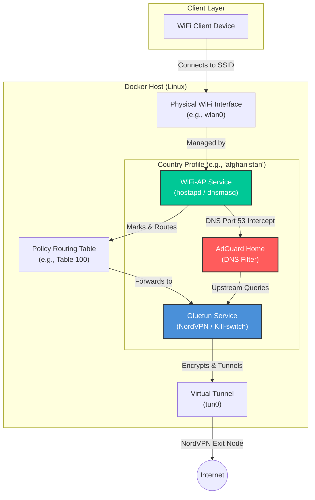
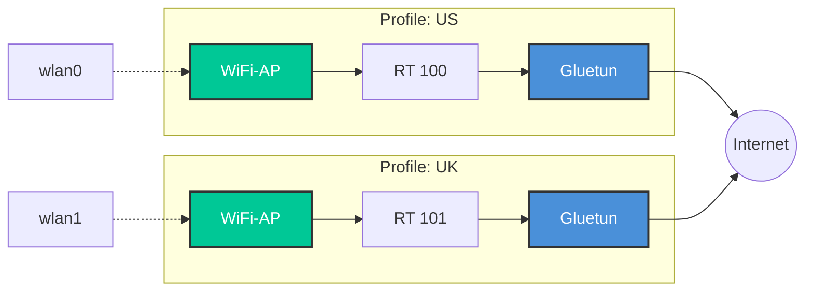

# NordVPN Dockerized Access Point (NordVPN-AP)

A powerful, multi-profile Dockerized solution to turn your Linux machine into a NordVPN-protected WiFi Access Point. It features a sleek interactive wizard for setup and management, supporting both **NordLynx (WireGuard)** and **OpenVPN** protocols.

## 🚀 Features

-   **Interactive Wizard & CLI**: A single entry point (`startup.sh`) for both interactive setup and scriptable management.
-   **Multi-Profile Support**: Run multiple hotspots simultaneously on different WiFi interfaces (e.g., one for US, one for UK).
-   **NordLynx & OpenVPN**: Native support for high-performance NordLynx (WireGuard) or traditional OpenVPN.
-   **Built-in Kill-Switch**: Powered by [Gluetun](https://github.com/qdm12/gluetun), ensuring no data leaks if the VPN connection drops.
-   **DNS Ad-Blocking**: Integrated per-stack AdGuard Home intercepts DNS queries to block ads while tunneling requests securely through the VPN.
-   **WiFi Security**: Supports WPA2-PSK, WPA3-SAE, and Mixed mode.
-   **Auto-Audit**: Automatically probes WiFi hardware to select optimal Channel, Mode, and Width.
-   **Health Monitoring**: Integrated health checks for VPN connectivity, public IP verification, and routing rules.
-   **Conflict Detection**: Automatically prevents IP, Subnet, and Interface conflicts between multiple country profiles.

---

## 🏗 Architecture

### Single Profile Flow
Each profile consists of three primary services: **Gluetun** (VPN), **WiFi-AP** (Hotspot), and **AdGuard** (DNS Ad-Blocking). Traffic is routed through dedicated policy routing tables on the host to ensure all connected clients are protected, while DNS requests are silently intercepted and filtered.



### Multi-Country Scalability
The architecture supports running multiple stacks concurrently by isolating each profile with its own physical interface, subnet, and routing table.



---

## 🛠 Prerequisites

-   **OS**: Linux (tested on Ubuntu/Debian/Garuda).
-   **Docker & Docker Compose**: Installed and running.
-   **Hardware**: A WiFi network card that supports **AP (Access Point) mode**.
-   **Tools**: `curl`, `jq`, `iw`, and `fzf` (required for wizard).

---

## 🚦 Usage

### 1. Launch the Setup Wizard
```bash
./startup.sh
```
Follow the interactive prompts to create or edit country profiles.

### 2. Access the AdGuard Home Web UI
Once connected to the AP (e.g., `ap_us`), open a browser and navigate to the gateway IP on port 3000:
```
http://192.168.60.1:3000
```
*(The exact IP depends on the AP_IP configured during the setup wizard for that profile).*

### 3. CLI Management
`startup.sh` also acts as a CLI for management tasks.

| Command | Description |
| :--- | :--- |
| `./startup.sh list` | List all profiles and their current status. |
| `./startup.sh start <name>` | Build and start a specific country profile. |
| `./startup.sh stop <name>` | Stop a profile (keeps containers). |
| `./startup.sh health` | Check VPN connectivity and routing for all profiles. |
| `./startup.sh logs <name>` | Follow logs for a specific profile. |
| `./startup.sh delete <name>` | Completely remove a profile and its config. |

---

## 📂 Project Structure

-   `startup.sh`: Unified interactive wizard and CLI management tool.
-   `country/`: Contains per-profile configurations (e.g., `country/afghanistan/.env`).
-   `access_point/`: Docker build context for the WiFi Access Point service.
-   `docker-compose.template.yaml`: Template used to generate instance stacks.
-   `.env.credentials`: Secure storage for your NordVPN keys/passwords.

---

## 🔧 Configuration

Each profile has its own `.env` file located in `country/<name>/.env`. Key variables include:

-   `COUNTRY`: Profile identifier.
-   `VPN_TYPE`: `wireguard` or `openvpn`.
-   `SERVER_COUNTRIES`: Target country for the VPN connection.
-   `AP_IFACE`: The WiFi interface to use.
-   `AP_SSID` / `AP_PASSWORD`: WiFi credentials.
-   `ROUTING_TABLE`: Unique ID for the policy routing table (auto-assigned).

---

## 🚑 Troubleshooting

-   **WiFi Interface Errors**: Ensure your card supports AP mode. Run `iw list` and look for `AP` in "Supported interface modes".
-   **VPN Connection Issues**: Run `./startup.sh health` to check if `tun0` is up and if the public IP is correctly masked.
-   **Logs**: Use `./startup.sh logs <name>` to see detailed output.

---

## 🔒 Security Note

This project stores credentials in `.env.credentials` and per-profile `.env` files with `600` permissions. Ensure your host system is secure and do not commit your `.env` files to public repositories.